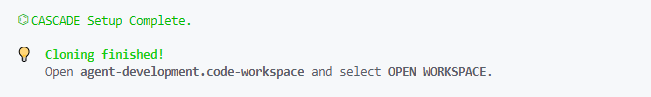
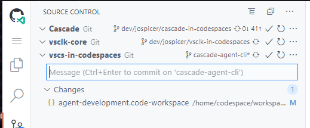
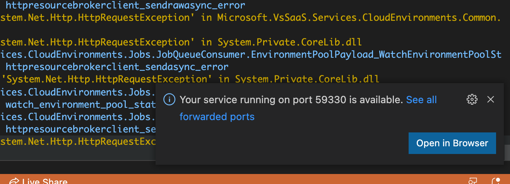
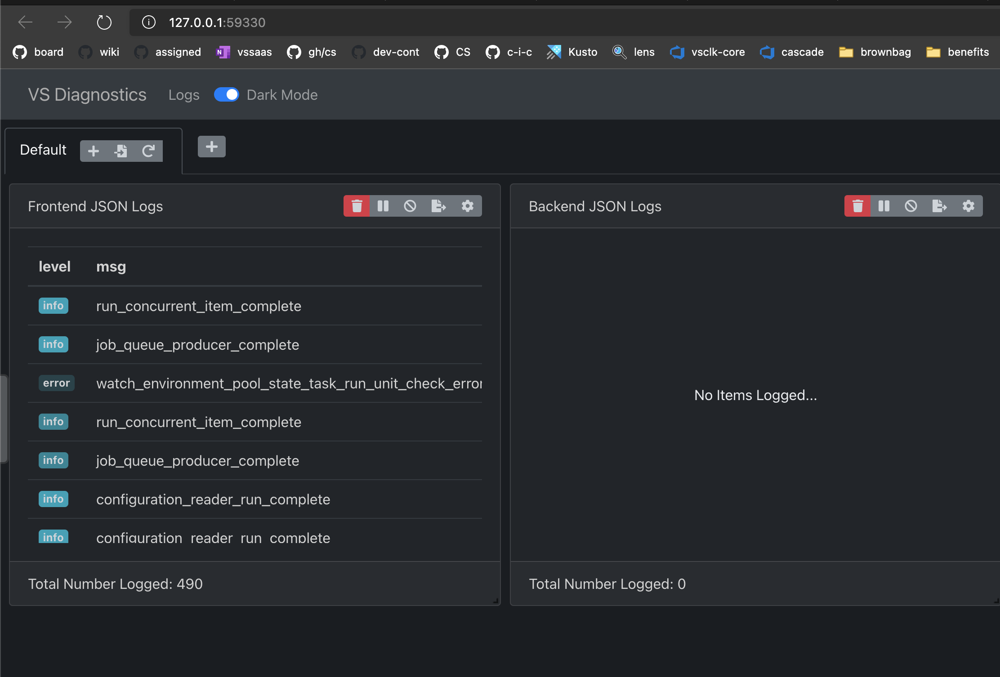
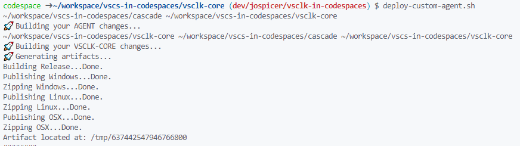
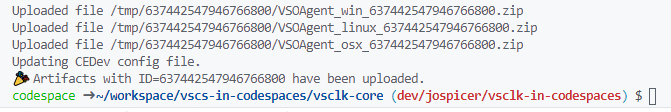

# vsclk-core in Codespaces

> _Please file an issue with the `dogfooding: vscs` tag in `microsoft/vssaas-planning` and tag [Aaron Paskin](https://github.com/anpaskin) and [Josh Spicer](https://github.com/joshspicer) with any issues._

## One-time setup
1. If you do not have write-access to the `vsls-contrib/vscs-in-codespaces` repo, request it. Forking is an option, but you'd need to update your fork when changes are made in this branch.
1. Go to https://dev.azure.com/devdiv/_usersSettings/tokens and generate a Personal Access Token that will be used to clone the vsclk-core and Cascade repos.
1. Click `New Token` and select the following settings:
    * `Organization: All accessible organizations`
    * `Scope: Code Read & Write`
    * `Scope: Packaging Read`
1. Copy the token
1. Go to https://github.com/settings/codespaces and click `New secret`
    * Name: `ADO_PAT` _:warning: Warning: the name must be called `ADO_PAT` for the init scripts to work!_
    * Value: Paste in the generated PAT
    * Repository access: `vsls-contrib/vscs-in-codespaces` (or if you are using a fork, select your fork)
1. You may also add secrets to fill in certain values in the Codespace's appsettings.json, which is used for the devstamp when running the frontend and backend services.
    * Add a secret with name `TUNNEL_KEY` and enter the value of "tunnelRelayPrimaryAuthKey" from your local appsettings.json to automatically use it in your Codespace's appsettings.json
    * Add a secret with name `APP_SECRET` and enter the value of "appServicePrincipalClientSecret" from your local appsettings.json to automatically use it in your Codespace's appsettings.json
    * Add a secret with name `DEVELOPER_ALIAS` and enter the value you want to use for "developerAlias" in appsettings.json and "userId" in testsettings.json. Since the latter should be a GitHub account username, it is recommended to use your GitHub username for this value. You can always directly edit either of these files if you'd like to use another value.
    * Add a secret with name `CODESPACES_TOKEN` and enter an access token to automatically use it in your Codespace's testsettings.json. To get an access token in VS Code, run the `Codespaces: Get Access Token` command. Make sure you run the GitHub Codespaces extension's command (`github.codespaces.getAccessToken`, not `codespaces.getAccessToken`). Note for `github.codespaces.getAccessToken` to work, you will need *"isInternal": true* flag in %UserProfile%\codespaces-settings.json
    


That's it, you're ready to start creating Codespaces! :rocket:

## Create a Codespace

1. Ensure you are on the `codespaces-service` branch of the repo page at https://github.com/vsls-contrib/vscs-in-codespaces/tree/codespaces-service. If you are using a fork, start from your fork's repo page, not the `vsls-contrib/vscs-in-codespaces` repo.

2. Click Code > Open with Codespaces


3. The codespace will load and automatically clone the vsclk-core and Cascade ADO repos. Wait for the configuration to complete.

> You can check provisioning status with the `Codespaces: View Creation Log` vscode command. You will see the text in the following image when complete.  It takes about a minute to clone and restore both repos!
> 
> 

4. **AFTER** the initialization script completes, open `codespaces-service.code-workspace` from the file explorer and select `OPEN WORKSPACE` (or click the workspace pop-up that will automatically appear).

### Organization

This will give you a clean workspace organized like:

```
.
├── Cascade
    ├── bin
    ├── ...
└── vsclk-core
    ├── bin
    ├── ...
```

This will recursively pull in the workspace and `.vscode` config for each of the repos. This will also populate the "Run" with the relevant launch commands.


5. In the C# extension settings, ensure that Omnisharp: Project Load Timeout is > 200.

6. Run the VSCode command Omnisharp: Select Project to set VSCode's focus to the project you're working on. Selecting a project will help omnisharp enable intellisense and other nice editor features for the code you're working on.

For agent development you may want to select the VSOnline.sln.

For services development you may want to select the Codespaces.sln.

Wait until all projects are loaded in the Omnisharp logs (If there is an error, you may need to run `dotnet restore` in the VS Code command line). You can set the `Omnisharp: Default Launch Solution` in the C# extension settings as well.


7. Begin coding with Intellisense! Via the source control panel you can see changes you've made in Cascade, vsclk-core, or this bootstrap repo.  Make commits how you normally for each individual repo.



The `.codespaces` directory cloned from vscs-in-codespaces is not deleted, and can still be accessed via your terminal at `~/workspace/vscs-in-codespaces/.codespaces`.  The `.codespaces` directory is added to your `$PATH`, letting you run any of our pre-build scripts in that directory from your terminal.


## Running Your Devstamp

It is recommended to run your devstamp from this Codespace on web rather than desktop, as you'll need your local VS Code instance pointing to your devstamp to create devstamp Codespaces.

:warning: Warning: Ngrok is not currently configured in this Codespace, so you should use your devstamp tunnel Azure Relay url instead, which you can set up using the instructions [here](https://github.com/microsoft/vssaas-planning/wiki/Integrated-Devstamp-Tunnel)

1. If you didn't add the necessary secrets as described in the **One-time setup** section, you can manually edit your appsettings.json in the ~/CEDev directory. Otherwise, continue with step 2.

2. Open the Run tab (the play button in the left margin).

3. Select and run FrontEnd+Backend API Launch.


4. You can now use your devstamp as usual. See the [E2E devstamp wiki](https://github.com/microsoft/vssaas-planning/blob/master/docs/Devstamp/e2e-devstamp.md) for how to use your devstamp.

> Note: The React **Diagnostics server** will be started, but will not open a new tab automatically. Simply click the toast msg or launch the service running on port 59330 from your "ports" menu.
> 
> 
> 


## Deploying a Custom Agent

You can run the `deploy-custom-agent.sh` script (on your `$PATH`, source [here](https://github.com/vsls-contrib/vscs-in-codespaces/edit/codespaces-service/.codespaces/deploy-custom-agent.sh)) which will:

1. Build Cascade
2. Build Vsclk-Core
3. Generate the agent artifacts with Cascade's `DevTool.dll`
4. Upload to Azure to be used in your personal devstamp with vsclk-core's `VsoUtil.dll`.

> You may specify the **`--no-build`** flag to skip steps 1 and 2, although you'll need to have built at some point to have the `DevTool` and `VsoUtil` dlls present.


The output will look similar to this:




Your appsettings.json file in `~/CEDEev` will be updated with the correct values.

## Running E2E Raw API Tests

See the **Codespaces in Codespaces** section of the [Automated Test Runners wiki](https://github.com/microsoft/vssaas-planning/blob/master/docs/Design/automated-test-runners.md#codespaces-in-codespaces) for instructions on running the E2E tests in vscs-in-codespaces.

## Known Issues and Planned Improvements
* The backend service crashes sometimes. This seems to be an issue with the debugger, so running the services without the debugger (Ctrl + F5) should prevent this error. Please comment on this issue if the services continue to crash while running without the debugger [#1888](https://github.com/microsoft/vssaas-planning/issues/1888)


